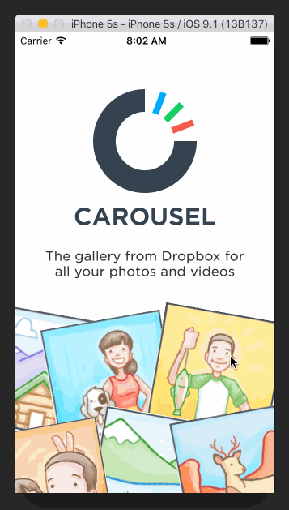
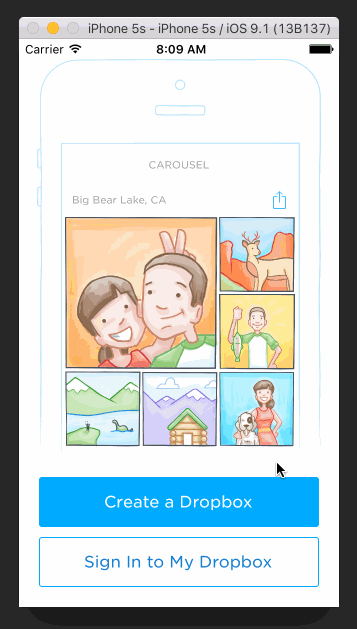
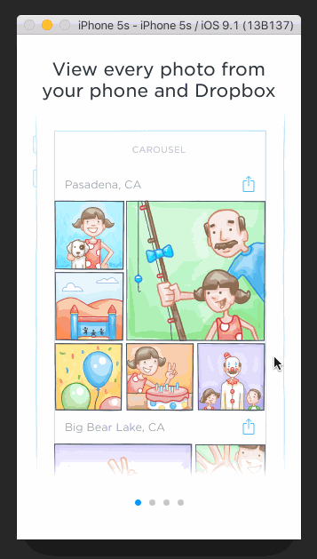
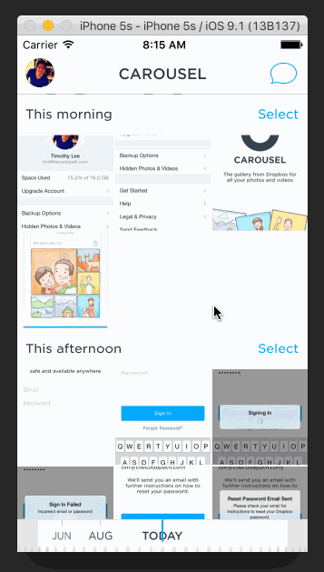

# Dropbox Carousel

Bit more complicated than last week.

`Time spent: 8 hours`

## Requirements

### Welcome

- [x] Transform the illustrations on scroll
- [x] Clamp the translate min values so when you scroll down the illustrations don't fly everywhere. They still have some rotation and scale so it isn't a hard end.

### Sign in

- [x] Tapping on email/password reveals the keyboard and shifts the scrollview and Sign In button up.
- Upon tapping the Sign In button.
  - [x] If the username or password fields are empty, user sees an error alert.
  - [x] If credentials are incorrect, user sees a loading indicator for 2 seconds followed by an error alert.
  - [x] If the credentials are correct, user sees a loading indicator for 2 seconds followed by a transition to the Sign In screens.
- [x] Optional: When the keyboard is visible, if the user pulls down on the scrollview, it will dismiss the keyboard.
- [x] Optional: On appear, scale the form up and fade it in.

### Tutorial

- [x] User can page between the screens
- [x] Optional: User can page between the screens with updated dots
- [x] Optional: Upon reaching the 4th page, hide the dots and show the "Take Carousel for a Spin" button.

### Logged In

- Image Timeline
  - [x] Display a scrollable view of images.
  - [x] User can tap on the conversations button to see the conversations screen (push).
  - [x] User can tap on the profile image to see the settings view (modal from below).
- Conversations
  - [x] User can dismiss the conversations screen
- Settings
  - [x] User can dismiss the settings screen.
  - [x] User can log out
